# The Chamelot: OpenRTP Engine 🎰

**OpenRTP Engine** is a state-of-the-art, high-precision PID control system designed for stabilizing Return to Player (RTP) in gaming environments.

---

## 🌪️ Chaos Mode Stress Testing
The engine is verified for extreme volatility. Below is a **10,000 Spin Chaos Stress Test** showcasing the PID's ability to maintain a 90.0% RTP target even during multiple "Black Swan" events and random bet spikes ($1.0 - $3000.0).


* **RTP Convergence:** Watch the Purple line (Actual RTP) snap onto the Red dashed line (Target) with extreme precision.
* **PID Response:** The control signal (Signal u) dynamically adjusts between our safety bounds (-0.9 to +2.0) to stabilize house profit without breaking the "natural" feel of the game.

---

## 🚀 Quick Start

### 1. Requirements
- Python 3.8+
- NumPy
- Matplotlib (Optional, for Dashboard visualization)

```bash
pip install -r requirements.txt
```
## Algorithm Flow

```mermaid
graph TD
    A["<b>Definitions / Variables</b><br/>P_i = Probability, V_i = Symbol Value<br/>Bet_i = Bet Amount, Payout_i = Payout<br/>H = House Edge (Constant)"] --> B
    B["<b>RTP (Return to Player)</b><br/>RTP_target = Σ (P_i * V_i)"] --> C
    C["<b>House Edge</b><br/>H = 1 - RTP_target"] --> D
    D["<b>Turnover</b><br/>T_n = Σ Bet_i"] --> E
    E["<b>Target Profit</b><br/>Target(n) = H * T_n"] --> F
    F["<b>Actual Profit</b><br/>P_n = Σ (Bet_i - Payout_i)"] --> G
    G["<b>Error (%)</b><br/>e(n) = [(P_n - Target(n)) / T_n] * 100"] --> H
    H["<b>PID Brain</b><br/>Enter PID -> Compute Signal (u)"] --> I
    I["<b>Asymmetric Clamping</b><br/>u_clamped = max(-0.9, min(2.0, u))"] --> J
    J["<b>Weight Update</b><br/>weight_new = weight_old * (1 + u_clamped)"] --> K
    K["<b>Update Weights</b><br/>Apply weight_new to Reel Ecosystem"]
```




### 📜 License

This work is licensed under a [Creative Commons Attribution-NonCommercial 4.0 International License](http://creativecommons.org/licenses/by-nc/4.0/).

- ✅ **Attribution:** You must give credit to the author.
- ❌ **Non-Commercial:** You may not use this material for commercial purposes.
- ⚠️ **Educational/Research only.**

> [!IMPORTANT]  
> **Commercial Use:** For commercial licensing, enterprise integration, or professional consulting, please contact the author directly via [LinkedIn](https://www.linkedin.com/in/katunyu-boonchumjai-12ba6334b/) or GitHub.

### 2. Launch the Simulator
Run the interactive CLI to stress-test your math:
```bash
python3 demo.py
```
---

##  Project Structure
- `core/rtp_engine.py`: The "Brain". Pure PID logic and weighted weight-adjustment equations.
- `demo.py`: Interactive CLI tool for "Black Swan", "Chaos", and "Soak" simulations.
- `output/`: Automated storage for high-resolution simulation dashboards (`recovery_dashboard.png`).

---
**Author:** [Katunyu Boonchumjai](https://github.com/Katunyu-Boonchumjai)  
**Connect:** [LinkedIn](https://www.linkedin.com/in/katunyu-boonchumjai-12ba6334b/)  
**Project:** The Chamelot  

 
 [](https://sonarcloud.io/dashboard?id=Katunyu-Boonchumjai_The-Chamelot-Engine)
 [](https://github.com/Katunyu-Boonchumjai/The-Chamelot-Engine/actions/workflows/main.yml)

___
## ⚖️ Legal Disclaimer

> [!CAUTION]
> **FOR EDUCATIONAL AND RESEARCH PURPOSES ONLY.**  
> The author, **Katunyu Boonchumjai**, provides this software "as is" without any warranties. In no event shall the author be liable for any claim, damages, or other liability, whether in an action of contract, tort, or otherwise, arising from, out of, or in connection with the software or the use or other dealings in the software.
>
> **Users are solely responsible for ensuring compliance with their local laws and regulations.**
