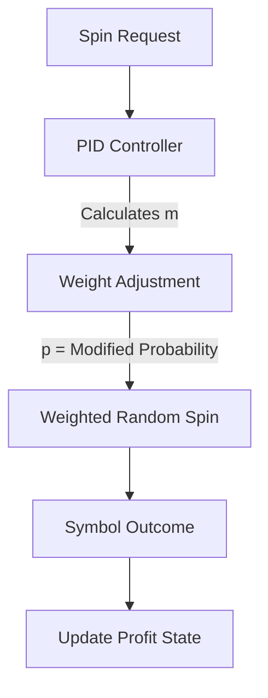

# ⚙️ Slot Engine Logic Flow

The Chamelot Engine uses a **Dynamic Weighting** system controlled by a PID loop to maintain a stable Return to Player (RTP) percentage while preserving randomness.

## Logic Diagram

## How it works:
1.  **PID Controller:** Monitors the current House Profit vs. Target Profit. It outputs a signal `m`.
2.  **Weight Adjustment:** The `m` signal is used to slightly increase or decrease the probability of specific symbols on the reel strip.
3.  **Weighted Random Spin:** The engine performs a single random selection based on the new probabilities.
4.  **State Update:** The outcome is recorded to inform the next spin's calculation.

> **Note:** This architecture ensures that the game remains "Natural" (no forced wins/losses) but strictly adheres to financial targets in the long run.
